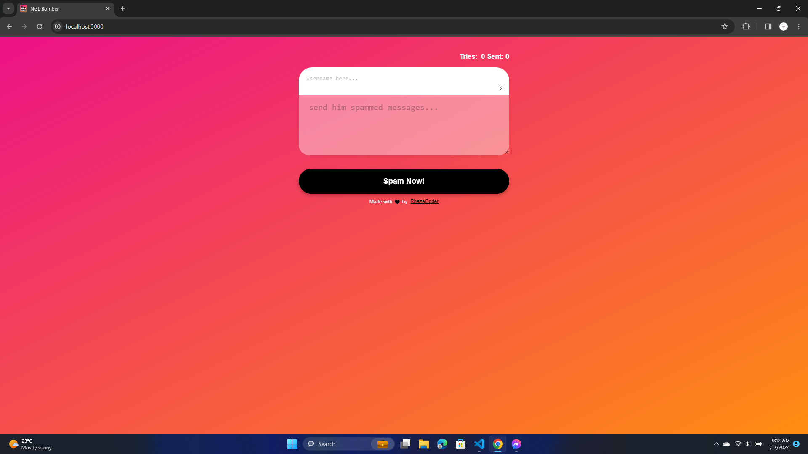

<h1>NGL Bomber</h1>

[ProjectOutput](https://git-scm.com/book/en/v2/Getting-Started-Installing-Git "Project Output")



### Introduction
------------
 - This project enables the spamming of messages within NGL from a browser-based interface.

### Requirements
------------
To deploy locally you need to install the following
1. [git](https://git-scm.com/book/en/v2/Getting-Started-Installing-Git "git")
2. [node](https://nodejs.org/en "node")

### Installation
------------
```bash
git clone https://github.com/RhazeCoder/ngl-bomber
```
```bash
cd ngl-bomber
```
```bash
npm install
```

### Starting
------------
- To run the project
```bash
npm run start
```

### Disclaimer
------------
- This project is intended for **educational purposes only**.
